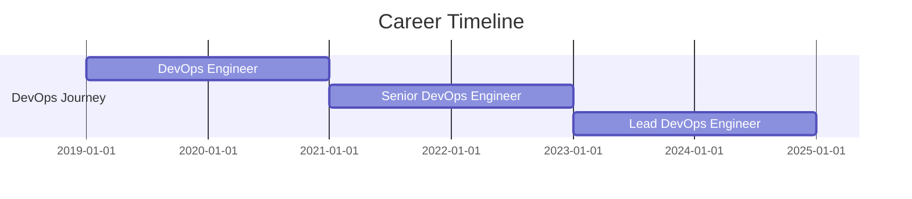

# 👋 Hi, I'm Chetan Soni

<div align="center">
  
  

  [](https://chetansoni-it.github.io)
  [](https://www.linkedin.com/in/sonichetan/)
  [](mailto:chetansoni9991@gmail.com)
  
  
  

</div>

---

## 🚀 About Me

```yaml
name: Chetan Soni
location: Bhopal, India
role: Lead DevOps Engineer
focus: 
  - Multi-Cloud Architecture (AWS, Azure, GCP)
  - Kubernetes Orchestration (EKS, GKE, AKS)
  - Infrastructure as Code
  - CI/CD Pipeline Design
  - Security Solutions
  - Generative AI in DevOps
currently_learning: Advanced Kubernetes Operators, eBPF, Platform Engineering
open_to: Collaboration, DevOps Consulting, Cloud Architecture Projects
```


### 💡 What I Do

- 🔧 **Design & implement** scalable cloud infrastructure
- 🚀 **Automate** everything from deployment to monitoring
- 🔒 **Secure** applications with zero-trust architecture
- 📊 **Build** comprehensive observability platforms
- 🤖 **Integrate** AI/ML into DevOps workflows

---

## 🛠️ Technology Stack

<details open>
<summary><b>☁️ Cloud Platforms</b></summary>
<br>


</details>

<details open>
<summary><b>🐳 Containers & Orchestration</b></summary>
<br>


</details>

<details open>
<summary><b>🏗️ Infrastructure as Code</b></summary>
<br>


</details>

<details open>
<summary><b>🔄 CI/CD & GitOps</b></summary>
<br>


</details>

<details open>
<summary><b>📊 Monitoring & Observability</b></summary>
<br>


</details>

<details open>
<summary><b>👨‍💻 Languages & Scripting</b></summary>
<br>


</details>

---

## 📈 GitHub Statistics

<div align="center">
  
  
  
  
</div>

<div align="center">
  
  
  
</div>

<div align="center">
  
  
  
</div>

---

## 🏆 Certifications

<div align="center">


</div>

---

## 🎯 Featured Projects

<div align="center">

[](https://github.com/chetansoni-it/particle41-devops-challenge-senior)
[](https://github.com/chetansoni-it/node-postgres-redis-valkey)
[](https://github.com/chetansoni-it/chaos-monkey)
[](https://github.com/chetansoni-it/authelia)

</div>

---

## 💼 Professional Experience



---

## 📫 Let's Connect!

<div align="center">

| Platform | Link |
|:--------:|:----:|
| 🌐 **Portfolio** | [chetansoni-it.github.io](https://chetansoni-it.github.io) |
| 💼 **LinkedIn** | [linkedin.com/in/sonichetan](https://www.linkedin.com/in/sonichetan/) |
| 📧 **Email** | [chetansoni9991@gmail.com](mailto:chetansoni9991@gmail.com) |
| 🐙 **GitHub** | [github.com/chetansoni-it](https://github.com/chetansoni-it) |

</div>

<div align="center">

### 💬 Open to discussing:

`Cloud Architecture` • `Kubernetes` • `DevOps Strategy` • `Platform Engineering` • `Infrastructure Automation`

</div>

---

<div align="center">
  
  
  
  ⭐️ From [chetansoni-it](https://github.com/chetansoni-it) with ❤️
  
</div>
